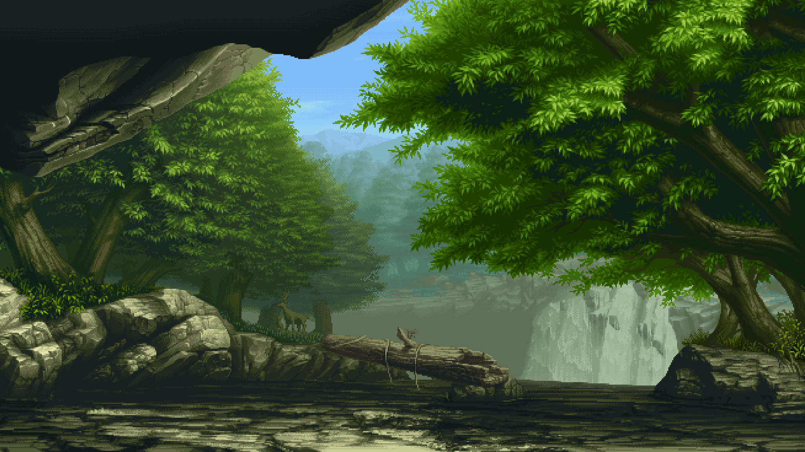

  

<h3 align="center">Full-Stack Developer</h3>

  
  
  
  
  
  
  
  

## About Me
Full-Stack Developer with experience in building web applications using modern backend and frontend technologies. Focused on clean architecture, scalable systems, and practical solutions. Interested in backend-heavy systems, APIs, and full-cycle product development.

## Tech Stack

  

  ### Languages & Frameworks
  

    
  

  ### Data
  

    
  

  ### Infrastructure
  

    
  

  ### Tools
  

    
  

 

  <picture>
    <source media="(prefers-color-scheme: dark)" srcset="https://raw.githubusercontent.com/polchduikt/polchduikt/output/github-contribution-grid-snake-dark.svg">
    <source media="(prefers-color-scheme: light)" srcset="https://raw.githubusercontent.com/polchduikt/polchduikt/output/github-contribution-grid-snake.svg">
    
  </picture>

